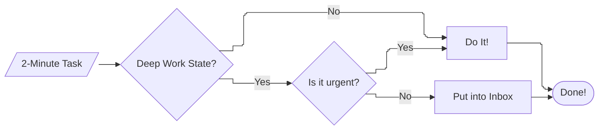

## 1.03 "Two Minute" Rule (GTD). [OUTLINE]

1. **The Scheduler Paradox (The Logic of "Now")**
    * **The Reference**: In Chapter 1.01, we established that context switching is the most expensive operation in the human OS. We know that every interruption clears our "L1 Cache" and forces a 20-minute reload.
    * **The Pivot**: What happens when the "administrative overhead" of *avoiding* the switch is actually higher than the switch itself?
    * **The Paradox**: if you spend 5 minutes documenting, tagging, and scheduling a 2-minute task to "protect" your deep work, you haven't saved energy - you have wasted 3 minutes of pure "system overhead".
    * **The Senior Insight**: Being a "Deep Work Purist" can actually become a form of *Procrastination Through Process*.
2. **The Protocol: Immediate Execution vs. The Buffer**
    * Don't just say "Do it". Give the **SRE Protocol**:
        * **State: Deep Work Mode**. If you are in the *"Zone"* (Chapter 1.01), the 2-minute rule is *suspended*. Everything goes to the Buffer.
        * **State: Cool-down**. When you are between tasks or in "Management/Communication" mode, the 2-minute rule is *active*.
    * **The Goal**: To prevent your JIRA backlog from becoming a "Graveyard of Trivialities".
3. **Garbage Collection for the Backlog**
    * **The Concept**: A backlog filled with 50 "tiny" tasks (e.g. "Fix type in README", "Update one Terraform variable") creates **Visual Noise**.
    * **The Science**: Even if you don't work on them, seeing them in your list triggers a micro-Zeigarnik effect.
    * **The Fix**: Treat the 2-minute Rule as **Real-time Garbage Collection**. If you can "Free the memory" in 120 seconds, do it now so the "scanner" (your brain) doesn't have to look at it again tomorrow.

## 1.03 "Two Minute" Rule (GTD). [DRAFT]
In chapter 1.01, we talked in detail about what context switching is, and established that it is the most expensive operation in the human OS. We know that every interruption clears our "L1 Cache" and forces a 20-minute reload. Also, we have known how to avoid the context switching and organize our workday. But' as you understand, that's only the beginning.

### The Scheduler Paradox.
Daily planning, booking time for "Deep Work" sessions, these are great practices, which afford us to switch off from distractions and get more results for the same time just going deeper into work. However, this method has one very important feature, it requires maintenance. But what happens when the "administrative overhead" of *avoiding* the switch is actually higher than the switch itself? 

As engineers we are always "on-call", even when we are working deeply on a code, or rolling out a very important fix to production, or maybe speaking at a meeting, at any time we can get another ad-hoc "task" into the inbox. Sometimes it can be a task which we plan as a future "deep work" session, sometimes just a *"food for thought"*, but sometimes (and to be honest, very often) those are very small atomic tasks which take 1-2 minutes: create a ticket, make a 2-line code review, answer a common question in Slack, etc. Just imagine, if you spend 5 minutes documenting, tagging, and scheduling a 2-minute task to "protect" your deep work, you haven't saved energy - you have wasted 3 minutes of pure "system overhead". Doesn't sound like a very productive move, doesn't it?  

When we discover the power of "Deep Work*, we often become so protective of our mental state that we start using the "Process" as a shield to avoid the messy, small realities of the job. Talking our language, this is a **System Deadlock**. You are so busy "optimizing the CPU for high-throughput" that you refuse to handle the "I/O interrupts" necessary for the system to actually communicate with the outside world.  
If a colleague needs a 30-second "Yes/No" answer to unblock their 4-hour Sprint, and you make them "put it in the backlog", you have saved your 30 seconds but wasted 4 hours of company time. Let's call it **Waste Amplification**. This isn't productivity; it's *Professional Ego*. You are protecting your "flow state" at the expense of the "System State".

I want to convey to you that the "Process" is a tool for engineers, not a religion of the martyr. If your "Deep Work" rules prevent you from performing trivial system maintenance, you aren't an engineer; you are a bottleneck.  

Working in different companies, I met many people who consider themselves so productive that they book their entire day for deep work, ignoring any incoming interruption and any message. But I've never heard as many negative comments about anyone as I have about these people. I have no idea in which cases that was "productivity purism" and in which it's just a try to guard themselves from ad-hoc activities, but from my point of view, and point of view of work done, it's not so different. A truly senior engineer understands that their job isn't just to "run code", but to be a *High-Speed Router* for the team. If you are a "Null Route" for 2-minute requests, you are causing a *Distributed System Congestion*.  
If you are "too busy" to give 5 minutes for a favor, you haven't mastered your time; you have been conquered by your backlog. True mastery is having the "Headroom" to handle the unexpected.

### But what about the 2-minute tasks?
So what should we do with such a small task in this case, you ask me.  
American author and productivity consultant David Allen, in his book "Getting Things Done" (GTD) offers a very elegant solution to our problem - "2-Minute Rule". He argues that *if a task can be completed in two minutes or less, it should be done immediately*. This is a very simple approach that can be easily integrated into your work and your life, designed to prevent the stress of a growing backlog of unfinished items.

I like this rule. Finishing 2-minute tasks immediately, you immediately get dopamine response, immediately close the loop, and immediately remove these tasks from your working memory. This is a great rule, when we speak about productivity itself and your personal mental health. However, I can't just say "Do it!". In real life, and real engineer work, it's not so simple; opposite, it is a very complex art to learn to distinguish critical tasks that require an immediate response from those that can wait for a while. Some yes-or-no questions can be of critical importance, as they can block large-scale pipelines which can affect your company's business; others, however, can wait for hours or maybe even days to be resolved without having any impact.

I can't give you a proper rule to separate the critical ones, from the rest. It depends on the task itself and there are thousands of variables. But if you see that the task can block someone's work right now – it's critical. Maybe not for you and for company, but for someone.   
Another good practice, if you can't define yourself how urgent the task is, just ask the colleague who initiated it: "Yes, I can do it today, does it wait until 15 PM?", or until tomorrow, end of the week, etc. We will speak about that more on Layer 2 of this book, when we will discuss a panning.  

So, now let's define how we should use the "2-Minute Rule".   
Doing the work we can have one of two states. (1) State of "Deep Work", when you must be focused on what you are doing, and the time beyond your "Deep Work" sessions, let’s call it a state of "Shallow Work". When you are in  "Shallow Work" state, the "2-Minute Rule" is always active. All 2-minute tasks are completed as come in. When you in "Deep Work" state, all incoming 2-minute tasks go to your "daily inbox". Just write them down using whatever method works best for you (digital or analog) and carry them out after you finish your “deep work” session. To reinforce this rule, let's illustrate it using a flowchart:

// --- work in progress ---