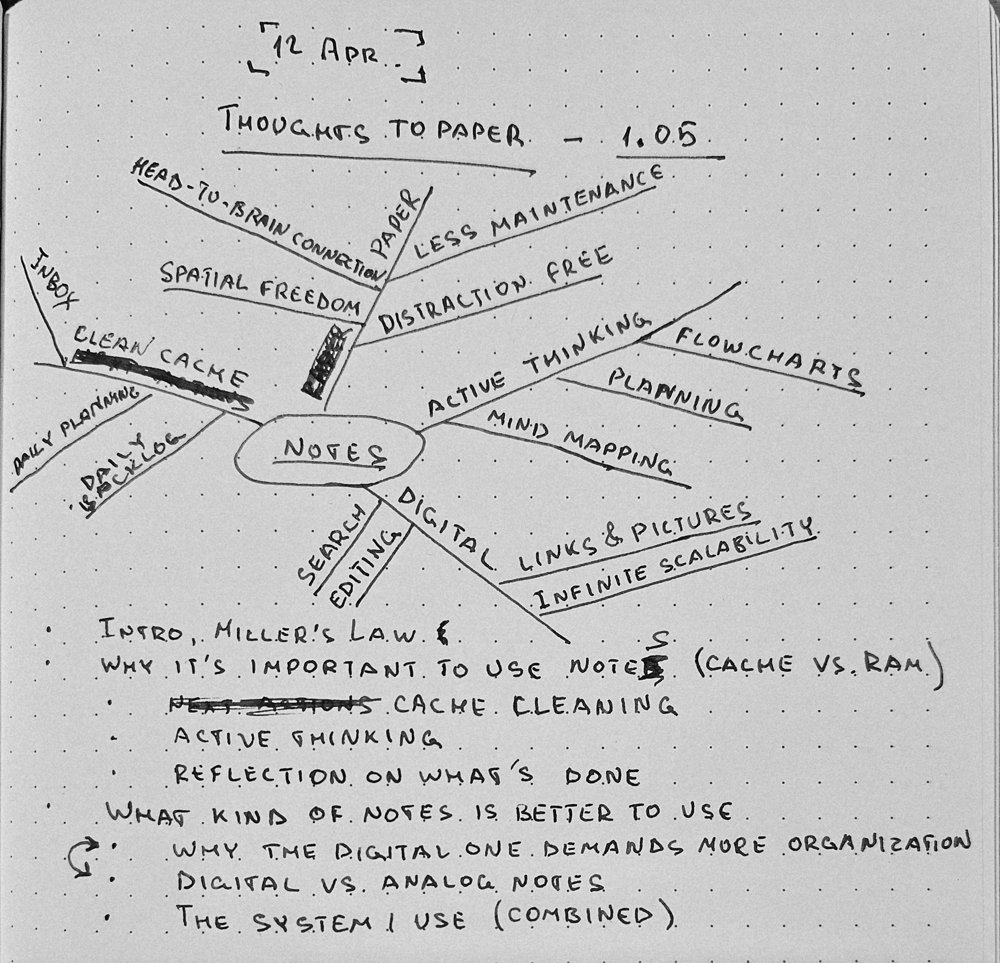

## 1.05 Offloading the Cache: The Power of Paper. [OUTLINE]

- **Intro**. Miller's Law - The Hardware Limitation
- **Why it's important to use notes (Cache vs. RAM)**
	- Active thinking (RAM)
	- Cache cleaning
	- Reflection on what's done
- **What kind of notes is better to use**
	- **Digital vs. analog notes**
		- **Paper (The "Write-Ahead Log"):**
		- **Digital (The "Persistent Database"):**
			- **The Trap:** Many people try to use Digital for "active thinking," but the friction of "Where do I put this? What tag do I use?" creates **Input Latency**.
        - **The Logic:** Paper is for _creating_ information; Digital is for _retrieving_ it.
	- **Digital Organization Paradox**.
		- **Why Digital is harder:**
	    - **Advice:** Digital notes need a "Schema." How to avoid turning records into a "black hole."
	- **The Hybrid System: The Best of Both Worlds**: My current system implementation. 
		- paper (RAM) - active thinking, inbox, daily to-dos
		- digital (disk) - archive, references, long-term data with tagging and search
- **Bonus**: mind-map of current chapter from my paper notebook.

## 1.05 Offloading the Cache: The Power of Paper. [DRAFT]

The human brain is a powerful pattern-matching machine, capable of making complex—and sometimes vital—decisions. But, unfortunately, our biological hardware has strict limitations. The first of them is the limit on the capacity of processing information, we already spoke about. It's described by the Miller's $7±2$ Law, which argues that the number of objects that average human brain can hold in its short-term memory (let's call it "L2 Cache") is *seven plus or minus two*. To be honest, that's not so much when you work with complex multilayer distributed systems. Developing the architecture, and observing the whole system, sometimes we have to keep track of dozens of subsystems, and each of them may have dozens of different parameters and features.  
Another weakness we face on a daily basis is our long-term memory. On one hand, we remember many different things from different areas of our work and life, on the other—sometimes it can be very hard to find the information we need right now in the depths of the "storage". Or even remember what you wanted to do an hour before. Human memory is extremely unreliable. We—as human beings I mean—are constantly forgetting important dates, passwords we use not so often, where the car is parked, and even what we went into a room for. During working hours that list grows much faster: specific configurations, requests from colleagues, details about past tasks and incidents, and so on.

> The less often we retrieve certain information from our memory, the more likely it is that we won't be able to recall it when we need it.

Our memory isn’t just unreliable; it's a non-deterministic system. A few years ago, my wife handed me a concert ticket. The plan was simple: she and our child were at her parents' house, leaving me with a rare evening of total focus. I decided to "work just a little longer." I was so deep in the work that my brain simply dropped the interrupt. I didn't remember the concert until an hour after the last song had ended. When your own hardware fails a critical task like that, how can you ever trust it again?
How many times have you forgotten that you should meet someone, or help your colleague with his task, or maybe to buy milk on the way home from the office? The amount of data in our brain is growing constantly. As a result, our internal Garbage Collector has to clean up the space for new data, deleting the data we don't use anymore.
Of course, we can actively optimize the data inside the brain by retrieving it from long-term memory over and over again, until more stable neural connections are formed. But even this has its limits, we can't optimize the data infinitely.
In engineering, we know that *every optimization has its limits*; that is **What Everyone Knows**.

### Improve your memory

We are very familiar with the solution; it's obvious, we use it ubiquitously in our work. But why it is not so obvious when we speak about other areas of our life? When the system lacks resources and there is no room for optimizations, we can just scale the system, extend the resources. So, if we can't rely on our memory, we attach external storage we can rely on.  

**Trusted Tools.**
You likely already know the solution I'm talking about: *Externalized Notes*. It's a very simple solution to a massive human architecture flaw. It doesn't matter which type of "external memory" you will use. It can be a paper notebook, or your favorite digital application, or even a scrap of paper. There are only two basic requirements it must meet: (1) the tool must be trusted; and (2) it should be fun to use for you. Because, if your brain finds it boring or can’t trust the tool—and this applies equally to any tool we use in our work and personal lives—it will resist and sabotage its use until you eventually give it up altogether.  
How many times have you given something up just because it's "inconvenient", or you just don't like how it looks, or any other reason your brain can come up with? I tried dozens of different text editors in my life, but I always gave up. Just because they are not as fun as my lovely Vim. They simply weren't as satisfying to use as Vim. I know there are more powerful, modern, and flexible solutions, but I can't help myself. Even now writing this chapter in *Visual Studio Code* I installed Vim emulation for it. Because this is the way I can trust this application. It makes the *VS Code* for me more predictable—I know any shortcut and any command I need—more responsive, and the new—for me—application finds its balance.
Just find a tool you like, satisfying to use, and completely trustworthy. This will help you to not ignore it, and keep using it. One more point I'd like to mention is that many professionals I have met in my live chooses predictably and emotional connection over novelty. When a tool never surprises you with a glitch, a break, or a sudden change, it fees up your mental bandwidth to focus entirely on the work itself. That's like a writer chooses a typewriter, or sketch artists keep using a fountain pen. (Or me and Vim.)

> “Out of clutter, find simplicity.” — Albert Einstein

**Notes as a memory extension.** 
The notes taking solves most of the underlined above problems. This IS the missing part which helps our brain to store more information than it can do. That's an amazing paradox. So simple thing as pice of paper can serve many functions: it can be a short-term reminder to buy milk, or it can preserve knowledge for descendants for centuries.
Below, we will examine in detail how and in what situations notes can be useful, and even how they can neutralize the shortcomings of human memory.

*Active Thinking*. We may not be able to hold more than $7±2$ items in our working memory at once. But if we take a sheet of paper or a whiteboard and draw a flowchart or a mind map, it allows us to see a more complete picture in real time, as if from a bird’s-eye view. The entire complex system you are developing is right before your eyes. You don’t need to mentally switch from one object to another to recall all the connections between them.  
This works not only for schemes and flowcharts. It could be any information worth considering: plans, checklists, equations, calculations, etc. When you have the full picture right before your eyes, it's much easier to see what's missing or how you can improve the project you're working on.

Even a Nobel Prize winner like Richard Feynman admitted that his brain couldn't handle the "processing" alone. When a historian called his notes a "record" of his thoughts, Feynman famously snapped back: "It’s not a record, not really. It’s working. You have to work on paper and this is the paper." He understood that to solve complex problems, you don't just record the results—you use the paper as an extension of your own mind.

The next time you work on another architecture, or a pipeline, just take a scrap of paper and write down each requirement the project must meet. Or sketch out the diagram or flowchart. Then, watching it, ask yourself "are there all steps, or maybe I am missing something?", "on which points can something go wrong?", etc. In this case the paper works as external RAM for our brain. It's part of thinking process which extends our $7±2$ objects limit; once the process is finished and you have your result, the paper can be thrown away—effectively "garbage collected".

Another way notes can extend our own memory, it is the *Notes as Storage* approach. Probably this is the most obvious one, which many people use in different areas of their lives. Since we can’t keep everything we’d like to remember in our heads, we can use notes as a repository for all the information we need. That can be any information you consider useful. (1) *Checklists* for actions you do periodically to do not forget or miss something; (2) *templates* of plans and reports you type in your tasks from day to day; or (3) a "cheat sheet" of commands, regular expressions, or code snippets you use daily, and so on. Some of these tips can save you a lot of time and help you avoid a dangerous mistake at a critical moment (such as when you’re in a hurry to get something done, or you have been woken up by Tier 2 at the middle of the night).

> WARNING: Never copy-paste documentation from your team’s wiki or other shared resources. Always refer to the *Single Source of Truth* (SSOT). If the original source is updated, your personal copy immediately becomes stale and potentially dangerous.

A third use case for notes is the *Daily Work Log*. You just write down any incoming task (action) you should do today. At the start of the day it looks like just a list of tasks you have planned for today. During the day you just write down any incoming task (activity) you get into the list, and mark each completed task as *done*. A work log helps solve many of the problems that arise in our daily work. (1) You have a reminder about what should be done, and never forget about a request you have gotten from your colleague or the issue you must fix. (2) Writing another line in your work log relieves your brain of the burden of holding that data in working memory, which reduces Zeigarnik's Effect impact. This is the *Cache Cleaning* we spoke about in previous chapters. (3) Work log saves time when selecting your next action. Finishing a task, you don't think about what you should do next, and you avoid checking multiple sources to decide what to do next because you have a single list of actions—your personal **SSOT**. (4) Every time when you tick another line of your work log, you get a micro-dose of dopamine. (5) The work log allows you to reflect on your output at the end of the day. You can see your progress—a key factor in maintaining momentum.  

Another important rule you should remember about this topic is:
> Do not forget to clean up your notes.

I recommend scheduling regular cleanup sessions for your notes. Your notes grow daily, some information in them becomes outdated or simply unnecessary. The more unnecessary information you have, the harder it is to find what you need. This isn't a demanding process; you can do it weekly (as I do) or monthly, depending on your note volume. I usually spend about 5-7 minutes at the end of the work week, and that's enough to organize what I got during the week and identify which notes have become stale or irrelevant.

We will dive dipper into notes taking on **Layer 2** of this book, when we speak about planning and organization. For now, remember that notes are the external hardware that compensates for our imperfect biological memory.
You can start to use them right now, and identify which of these approaches work for you. The next time you work just take a scrape of paper, or a fancy notebook, or maybe your favorite note-taking application, and write down each task incoming to you from the outer world. Then update it during the day, adding new tasks and making the completed ones as *done*.

### Digital vs. Analog Notes.
The most popular question I get from other people talking about note taking is "What kind of notes is better and which one should I use in my daily work?". Actually, this is a very tricky question, and it doesn't have a strict answer. To understand which is better to use, let's do a little research and weigh the pros and cons. After the research I'll provide you my personal approach, I use in my life and work. I hope this helps you decide which path is closer to you, and make the right choice.

#### Paper
Handwritten text is one of the oldest methods of storing and transmitting information that has survived to this day. Some consider it outdated, while others see it as the fastest, most reliable, and most versatile method. Despite the development of high technology, a huge number of people continue to use handwritten text as their primary method for keeping personal and professional records. Let’s take a closer look at why.  

The first advantage of paper notes is their *accessibility*. All you need are pen and paper. It works wherever you are. Without your laptop, phone, electricity, or internet connection. Many significant discoveries in our world were done on cocktail napkins in a bar.  

A paper probably is the fastest way to record information when it comes to creating visual representations, such as diagrams, flow charts and mind maps. You are able to scratch a simple diagram faster than the specific application will be opened. And this diagram or flowchart will be as flexible as your imagination, because pen and paper don’t have the limitations that apps do.

When I started to take handwritten notes while reading books or documentations, I noticed that I remember stuff much better when I take notes with a pen than when I just copy-paste or type the information into my digital notes. So, I've decided to find out if it is just a coincidence or is there something that allows me to better remember what I wrote down?  
And what I realized is that the "Hand-to-Brain" connection is not just a productivity myth; it is a well-documented phenomenon in cognitive neuroscience known as **Sensorimotor Integration**. When you take a pen to paper, you aren't just recording data; you are forcing your brain to perform a *"Handshake Protocol"* between your motor skills and your cognitive centers, ensuring the information is truly internalized.  

It looks like the paper is a great choice, isn't it? Now, let’s add a reality check to this optimistic picture.  

The first problem people usually encounter when using paper notes is its *searchability*. Indeed, you can add an index page into your notebook; you even can create a page to indicate which page each tag is on. However, you will never get the same *searchability* as in a digital notebook, where you can instantly find every page containing the a specific keyword.  
What should you do if you have collected so much data that you have several notebooks? You would need another one just to organize the index of all your notebooks. Furthermore, all of this takes up quite a bit of physical space. If you work from different places—the office and home, for example—this becomes a real problem.  

Paper is not a universal medium because it is difficult to store some types of data, such as URLs, articles, or maybe documentation you have decided to save for later. Trying to manually transcribe a large block of text into a paper notebook instead of just copy-pasting it is a waste of time—it is a clear case of **System Toil** we want to minimize.

Another downside of the paper notebook is the issue of **Disaster Recovery**. It can be lost, damaged, or destroyed, and I don't think anyone has a backup of their physical notebook. I certainly don't.  
Does it mean we should use digital applications for our notes? Let’s take a look at their specifications first.

#### Digital Notes
There are countless different apps and services for taking notes. They may differ from one another in terms of specific features, but the basic idea is always the same. Digital notes are free of most of the drawbacks associated with paper. They can be easily backed up, so you don't lose all your progress by losing a single copy. The digital notes have great *searchability*; you can find the note you need using a keyword or tag very quickly. You can store as much information as you need, organizing it into directories by theme,area of responsibility, or however you wish. Any type of information can be copied into your notes: URLs, pictures, audio files, video, and more.

Then, if digital is so superior on paper, why do so many people still use paper for their notes?

Unfortunately, digital notes have too many *productivity traps*. When you want to practice *Active Thinking* using digital notes, you can't completely switch off from distractions. You always see notifications; even if your computer is in DnD (Do not Disturb) mode, the applications that can distract you are still there. Open tabs in your browser, documents that remind you of other tasks, and even battery charge indicator are continuously switching your brain away from the current thinking process.

The digital environment prevents you from fully concentrating. Even if you avoid external distractions, another form of friction appears: "Where do I put this? What tag should I use? Why is the spellchecker underlining this word?" All of this creates Input Latency, which can sometimes be longer than the thinking process itself.  
Furthermore, digital tools have inherent input limitations—drawing, quick sketches, or messy annotations are often harder or slower than they are on paper. There is also a heavy dependency on hardware and software; your notes become inaccessible if your device dies, your battery drains, or your app crashes.

**The Digital Organization Paradox**
The space in a digital notebook can feel almost limitless—which may seem like an advantage, but it isn’t. We tend to dump in more and more information: articles, documentation, large code snippets, and so on, tagging everything heavily as we go. This creates a massive maintenance burden and demands a reliable organization scheme.

Without a strict structure, your notes may appear organized on the surface but are actually cluttered underneath. You might not notice it instantly, but day by day, your "digital brain" morphs into a Data Swamp. In a swamp, even if you have a "Search" bar, you get too many results (False Positives), which makes the search useless. This reinforces why "Searchability" isn't a magic fix for a bad system. I learned this the hard way: the key to survival is a predefined, consistent structure combined with regular decluttering sessions.

So, digital notes require much more maintenance and organization—and, as a result, more of your valuable time and attention. You must be careful to weed out unnecessary clutter and prevent your notes from turning into a "black hole." If they do, your brain will cease to trust them; you will begin to avoid them at all costs and eventually stop using them altogether.  

Returning to the question we started with—"Which kind of notes are better?"—you can see that every system has its pros and cons. I have spent the last 16 years migrating from paper notebooks to local digital notes and cloud-based services. Every time, I found a friction point that prevented me from using the solution the way I wanted to.

When I finally decided to stop this cycle of continuous migration, I took a piece of paper, split it into two columns (Paper and Digital), and wrote down their respective strengths and weaknesses. Then, I linked each trait to the function it serves by placing a number next to it: (1) Active Thinking, (2) Task List & Daily Log, and (3) Resource Storage. (There may have been other categories, but I didn't keep that piece of paper.) The first thing that struck me was that paper has advantages exactly where digital media has shortcomings, and vice versa. The solution I was looking for was found in less than five minutes. All that was left was to implement it.

**The Hybrid System: The Best of Both Worlds**
To solve the conflict between focus and searchability, I decided to implement a hybrid architecture that leverages both analog and digital mediums, using each to compensate for the other's inherent weaknesses. 

*Paper acts as the RAM*: I use it for active thinking, my inbox, and daily to-dos. It provides zero-latency input for "runtime" operations where speed and focus are critical.  
*Digital Notes act as the Cold Storage*: I use it for archives, references, templates, and long-term data. It provides the structured, searchable repository needed for *data persistence.*

This approach gives me a high-performance "workspace" during active sessions and a reliable, organized schema for information with long-term value.

To maintain this system, you need a protocol for moving data from *RAM* to *Disk*. At the end of every day or week, I perform a *Cache Flush*. This is 5–10 minutes process where I review all the notes I've done, and decide the fate of each entry.  
Most notes are temporary—scribbles, temporary calculations, small ad-hoc tasks that were completed, etc. This data is *garbage collected* (thrown away). However, *Persistent Data*, such as critical project insights or "lessons learned" is transcribed into digital system. Do not view this as toil; it is a **Verification Step**. By rewriting the note, you ensure that only "validated" information makes it into your permanent archive, preventing your digital storage from turning into a *Data Swamp*.  

**Defining Your Ingress Protocol**  
To stay productive, your movement of data must follow a predefined algorithm. In most cases you shouldn't spend your time on thinking about what and where you should save. This is very personal moment which can be different for different people. You must define your own "Ingress Protocol." But to make this journey a little easier for you, let's look at a few examples to understand how the system works. 

If the information has a TTL (Time To Live) off less than 24 hours, it stays on the page. For example: "Call John at 2 PM," a temporary variable name, or quick calculation for a load balancer. That has no sense to move all these data to a persistent storage, it will be just a noise which distract us from what is really important. Most of what we write down is "noise" once the task is done.
> Do not archive To-Do Lists.
If a piece of information will be useful in the future, you "promote" it by transcribing it into your Markdown files. Example: A complex SQL query you finally perfected, a post-mortem summary, or a project roadmap.

**Architecture Sustainability.**  
When choosing your digital *Storage Tier*, do not forget the rule about tool maintenance we defined in Chapter **1.03**. I have migrated my entire life twice because a service changed its terms, changed its subscription type, or pivoted its features. These migrations are expensive; they consume massive amounts of time and "cognitive credits."  

To stop this cycle of continuous migration, I moved to a *decoupled architecture*: local Markdown files organized in a simple directory tree. Why the local Markdown files are my choice: (1) **Zero Dependency**: Markdown is plain text. It doesn't matter if my editor (Obsidian, VS Code, or Vim) disappears tomorrow; the data remains accessible to any OS. (2) **User-Controlled Sync**: I use simple utility to keep the files updated between my laptop and phone. I own the transport layer and the storage layer. (3) **Searchable Schema**: By using a consistent directory structure (e.g., `/Projects`, `/Archive`, `/Reference`), I maintain high searchability without needing a proprietary database.

### Conclusion

Choosing a note-taking system isn't about finding the "perfect app"; it's about designing a stable interface for your thoughts. As an engineer, you know that the most reliable systems are often those with the fewest moving parts and the clearest protocols.  
By separating your *thinking* (RAM) from your *storage* (disk), you allow your brain to do what it does best: solve complex problems in real-time without the overhead of long-term data management. The hybrid system isn't just a "hack"; it's a way to ensure that your "input latency" remains low and your "data persistence" remains high.

Your next step is simple. Don't worry about building a perfect directory tree or finding the ultimate pen today. Instead, start with the *ingress Protocol*:
 - Keep a scrap of paper nearby during your next deep-work session.
 - Use it as a buffer for every interrupt and idea.
 - At the end of the day, perform your first *Cache Flush*.

 You will likely find that even this small change significantly reduces your cognitive load. In the next layer of this book, we will take these "validated" notes and look at how to organize them into a larger framework of *Planning and Project Management*. We have fixed the hardware; now it's time to optimize the software.

### Bonus
*As an example of active thinking, I’d like to share the mind map for the current chapter, which I drew up on the first day I started thinking it through:* 

